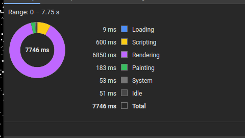
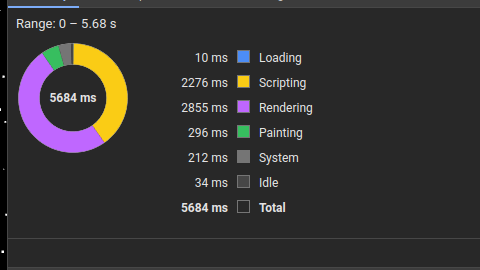
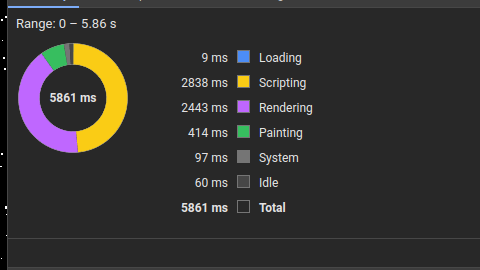
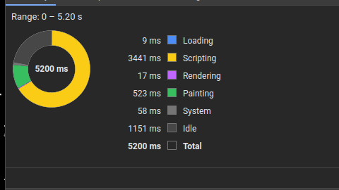
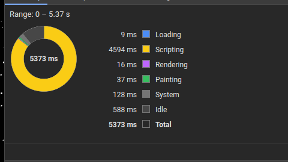
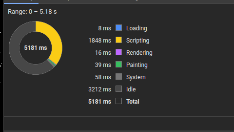
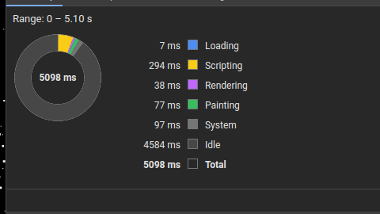

# Rendimiento

Analizar, detectar y solventar problemas de rendimiento es posiblemente una de las tareas más difíciles en el ámbito de la informática y, **en mi opinión**, especialmente en el mundo Web.

Principalmente por dos motivos: por un lado, JavaScript y por otro, el modelo de documento.

## JavaScript

JavaScript es interpretado, tipado dinámicamente y con un sistema de _Garbage Collection_ que hace que el desarrollo sea muy ágil y sencillo, como contrapunto esto límita mucho el control que tenemos sobre lo que ocurre a bajo nivel: no podemos liberar memoria cuando lo necesitamos, no podemos usar tipos numéricos (salvo el caso específico de `BigInt`) y tenemos que esperar a que el código sea interpretado para ser compilado y optimizado a byte-code (y en algunos casos a código máquina).

WebAssembly aparece como solución a todos estos problemas, implementando una máquina virtual que ejecuta código compilado, con tipos (y algunas extensiones interesantes como [SIMD](https://github.com/WebAssembly/simd)) y con control mayor<sup>1</sup> sobre la memoria.

> <sup>1</sup>La memoria de un módulo de WebAssembly sigue siendo un objeto de JavaScript, un `ArrayBuffer` que puede crecer y que está sujeto a las reglas del _Garbage Collector_ de JavaScript.

## Document Object Model

HTML, CSS y SVG son tecnologías pensadas, principalmente, para la representación de documentos (originalmente estáticos). Poco a poco se fueron añadiendo nuevas características a estos lenguajes que los hacían más dinámicos, como las propiedades `transform`, las transiciones, las animaciones, etc.

Sin embargo, en cualquiera de estos casos es el navegador el responsable último de cómo ese modelo de documento se representa en pantalla y cuáles son los atajos a tomar para optimizar esa representación. Y el navegador está hecho para representar documentos, no para jugar al [DOOM 3](https://wasm.continuation-labs.com/d3demo/) o al [Homeworld](https://gardensofkadesh.github.io/), o no al menos en origen. Para cubrir estos casos surgió `<canvas>` y las APIs de canvas 2D, WebGL y la recién publicada WebGPU.

## Pruebas

La idea es poder comparar cuál es la diferencia entre actualizar el DOM (HTML y SVG) y renderizar en un `<canvas>` con diferentes contextos: 2D, WebGL 2 y WebGL2 con un módulo de WebAssembly hecho especialmente para actualizar los buffers de WebGL.

### HTML

#### Usando `left` y `top`



Después de lanzar el _Performance profiler_ y tenerlo corriendo durante 7,75s podemos comprobar que en este caso casi todo el tiempo se va en el _Rendering_<sup>1</sup> (casi el 89% del tiempo), tanto es así que el render quita tiempo de otras tareas como la ejecución del _script_ o de tareas del sistema.

> <sup>1</sup>El _Rendering_ es la fase en la que se convierte los elementos del DOM en elementos que la GPU pueda entender.

#### Usando `transform`



Con la propiedad `transform` parece que mejora un poco la cosa y ahora del tiempo total, sólo el 50% del tiempo se dedica a _Rendering_, dejando que nuestro _script_ corra durante mucho más tiempo y permitiendo ejecutar más tareas del sistema.

### SVG

#### Usando `x` y `y`



Con SVG parece que seguimos mejorando, ahora sólo el 41% del tiempo se va en renderizar los elementos del SVG.

#### Usando WebAssembly


Con WebAssembly no parece mejorar la cosa.

### Canvas

#### Desventajas

- Reimplementar ciertas cosas que ya están implementadas en HTML/SVG.

#### Ventajas

- La principal ventaja de utilizar `<canvas>` es que podemos pintar en un espacio todos los elementos que nos interesen sin tener que recurrir a las costosas operaciones que conlleva modificar un elemento del DOM:
  - Layout
  - Attributes (Array de elementos Attribute)
  - DOMMatrix (Matriz de 4x4)
  - DOMPoint (Vector de 4 dimensiones)
  - ClientRects
  - Animation
  - Styling

#### 2D



Aquí la cosa cambia por completo, el tiempo dedicado a _Rendering_ es mínimo: sólo el 0,003% del tiempo total se dedica al _render_ del DOM. Sin embargo aumenta el tiempo que dedicamos al _Scripting_: 66% del tiempo total.

#### WebGL2



Con WebGL 2 parece que la cosa empeora, del tiempo total, el 88% se van en _Scripting_, sin embargo hemos reducido el tiempo de _Painting_ (este es el tiempo que la GPU dedica a pintar los elementos que se renderizaron en la fase de _Rendering_).

El problema de esta implementación es que cada estrella implica una _draw call_ y las _draw calls_ son costosas en términos de ejecución (tanto de GPU como de CPU).

#### WebGL2 usando un buffer



Si añadimos un `WebGLBuffer` que nos permita pintar todas las estrellas en una única _draw call_ (`drawArrays`) mejoramos considerablemente el tiempo de _Scripting_ pasando del 88% al 35%.

#### WebGL2 usando un buffer y un módulo de WebAssembly para actualizar la posición



Y por último, aquí tenemos la mejor versión de todas, reduciendo el tiempo de _Scripting_ del 35% al 0,05%. De 5 segundos, prácticamente el 90% es _Idle_.

### WebAssembly

#### Desventajas

- Tener que utilizar un lenguaje que normalmente se sale del _scope_ habitual de un equipo Web. Aunque existen alternativas como [AssemblyScript](https://assemblyscript.org), basado en [TypeScript](https://www.typescriptlang.org/).
- Límite de 4 GB de memoria. Esto es así porque [WebAssembly utiliza punteros de 32 bits](https://v8.dev/blog/4gb-wasm-memory#:~:text=Thanks%20to%20recent%20work%20in,512MB%20or%201GB%20of%20memory!) para las direcciones de memoria. La nueva especificación de `wasm64` añadirá punteros de 64 bits para direccionar más de 4GB de RAM.
- Las llamadas entre JavaScript y WebAssembly son costosas.

#### Ventajas

- Menor tiempo de compilación. El bytecode de WebAssembly ya está compilado y listo para ser ejecutado. La máquina VM de WebAssembly sólo debe optimizar el bytecode a código máquina.
- Para operar sobre muchos elementos, es infinitamente más rápido.

### Lenguajes

Para implementar la parte de WebAssembly decidí que quería probar algunos lenguajes nuevos además del clásico C y opté por: C, Odin, Zig y Rust.

#### C

Es de las opciones más sencillas. El código apenas son 19 líneas y en general todo funcionó a la primera.

```c
#define MAX_STARS 10000

typedef struct star_ {
  float x, y, size, velocity, dx, dy, angle;
} star_t;

star_t stars[MAX_STARS];

void update_stars(int width, int height) {
  for (int i = 0; i < MAX_STARS; i++) {
    stars[i].x += stars[i].dx * stars[i].velocity;
    stars[i].y += stars[i].dy * stars[i].velocity;

    if (stars[i].x < 0 || stars[i].x > width || stars[i].y < 0 || stars[i].y > height) {
      stars[i].x = width / 2;
      stars[i].y = height / 2;
    }
  }
}
```

Este módulo lo compilé con `-Wl,--export-all` para no tener que estar añadiendo atributos de visibilidad en el código:

```sh
clang --target=wasm32 -nostdlib -Wl,--no-entry -Wl,--export-all -o update-stars.wasm update-stars.c
```

NOTA: El código compilado es de los más pequeños.

#### Odin

[Odin](https://odin-lang.org/) es un lenguaje bastante reciente y súper interesante para todos los que quieran hacer cosas con gráficos: soporta un montón de librerías de gráficos (llamadas en la documentación `vendor` libraries).

El código es un poco más extenso que el de C pero apenas son 3 o 4 líneas más. Me gusta mucho la sintaxis de este lenguaje porque es muy escueto y se lee bastante fácil. Además de tener algunas características propias como los tipos `matrix` o los vectores que lo hacen especialmente interesante para trabajar con WebGL, OpenGL o Vulkan y unas cuantas que comparte con [Zig](https://ziglang.org/) como los `Slices` o las sentencias `defer`.

```odin
package main

Star :: struct #packed {
  x, y, size, velocity, dx, dy, angle: f32,
}

NUM_STARS :: 10000

@export
stars: [NUM_STARS]Star;

@export
update_stars :: proc(width: f32, height: f32) {
  for i := 0; i < NUM_STARS; i += 1 {
    stars[i].x += stars[i].dx * stars[i].velocity;
    stars[i].y += stars[i].dy * stars[i].velocity;

    if stars[i].x < 0 || stars[i].x > width || stars[i].y < 0 || stars[i].y > height {
      stars[i].x = width / 2;
      stars[i].y = height / 2;
    }
  }
}
```

Y para compilar nuestro código, al igual que pasa con C, el comando es muy sencillo.

```sh
odin build update-stars.odin -extra-linker-flags:"--export-dynamic" -file -target:freestanding_wasm32 -vet
```

> Uno de los problemas que tuve al compilar el código fue que a pesar de añadir el atributo `@export` a la variable `stars`, ésta no se exportaba en el `.wasm`. Pero la gente de [r/odinlang](https://www.reddit.com/r/odinlang/comments/1ao6a62/how_to_export_variables_to_webassembly/) fue muy maja y en seguida me sugirieron una solución (añadir `-extra-linker-flags:"--export-dynamic"`).

#### Zig

[Zig](https://ziglang.org) es de los lenguajes modernos que más tracción está ganando y que tiene algunas características muy interesantes como: `comptime`, las sentencias `defer` o las sentencias `try` y los `Slices` que ya mencioné en Odin. El principal problema es que el lenguaje todavía se encuentra en una fase muy beta (la versión actual es la 0.13.0) y no hay garantías de que el lenguaje no rompa la compatibilidad hacia atrás.

El código es muy similar al de C u Odin:

```zig
const Star = extern struct {
    x: f32,
    y: f32,
    size: f32,
    velocity: f32,
    dx: f32,
    dy: f32,
    angle: f32,
};

export var stars: [10000]Star = undefined;

export fn update_stars(width: f32, height: f32) void {
    for (&stars) |*star| {
        star.*.x += star.*.dx * star.*.velocity;
        star.*.y += star.*.dy * star.*.velocity;
        if (star.*.x < 0 or star.*.x > width or star.*.y < 0 or star.*.y > height) {
            star.*.x = width / 2;
            star.*.y = height / 2;
        }
    }
}
```

Una de las cosas que más me gustan de Zig es que el propio comando `zig` te permite crear plantillas de diferentes proyectos y en mi caso he usado `zig init-lib` para crear una estructura de proyecto sencilla y un `build.zig` (sí, para compilar los proyectos de Zig también se usa el propio lenguaje Zig).

```zig
const std = @import("std");

// Although this function looks imperative, note that its job is to
// declaratively construct a build graph that will be executed by an external
// runner.
pub fn build(b: *std.Build) void {
    // Standard target options allows the person running `zig build` to choose
    // what target to build for. Here we do not override the defaults, which
    // means any target is allowed, and the default is native. Other options
    // for restricting supported target set are available.
    const target = b.standardTargetOptions(.{
        .default_target = .{ .cpu_arch = .wasm32, .os_tag = .freestanding },
    });

    // Standard optimization options allow the person running `zig build` to select
    // between Debug, ReleaseSafe, ReleaseFast, and ReleaseSmall. Here we do not
    // set a preferred release mode, allowing the user to decide how to optimize.
    const optimize = b.standardOptimizeOption(.{});

    const lib = b.addSharedLibrary(.{
        .name = "update-stars",
        // In this case the main source file is merely a path, however, in more
        // complicated build scripts, this could be a generated file.
        .root_source_file = .{ .path = "src/main.zig" },
        .target = target,
        .optimize = optimize,
    });
    // If we do not specify this, the exports will be stripped from the library.
    lib.rdynamic = true;

    // This declares intent for the library to be installed into the standard
    // location when the user invokes the "install" step (the default step when
    // running `zig build`).
    b.installArtifact(lib);
}
```

Una vez tenemos nuestro `build.zig` y nuestro `src/main.zig` sólo tenemos que ejecutar `zig build` para crear nuestro módulo de WebAssembly `update-stars.wasm`.

#### Rust

De todas estas opciones, ésta es la que menos me ha gustado. [Rust](https://rust-lang.org) tiene un montón de características muy interesantes pero de todos los lenguajes, me ha parecido el más farragoso para trabajar con WebAssembly, al menos para hacer algo pequeño como lo que quiero hacer.

```rust
use wasm_bindgen::prelude::*;

#[derive(Copy, Clone)]
pub struct Star {
    x: f32,
    y: f32,
    size: f32,
    velocity: f32,
    dx: f32,
    dy: f32,
    angle: f32,
}

#[no_mangle]
#[used]
pub static mut stars: [Star;10000] = [Star { x: 0.0, y: 0.0, size: 0.0, velocity: 0.0, dx: 0.0, dy: 0.0, angle: 0.0}; 10000];

#[no_mangle]
#[wasm_bindgen]
pub unsafe fn update_stars(width: f32, height: f32) {
  for i in 0..10000 {
      let star = &mut stars[i];
      star.x += star.dx * star.velocity;
      star.y += star.dy * star.velocity;

      if star.x < 0.0 || star.x > width || star.y < 0.0 || star.y > height {
          star.x = width / 2.0;
          star.y = height / 2.0;
      }
  }
}
```

El código en sí se parece mucho, aunque he tenido que recurrir a `unsafe` para indicar que la función puede acceder a un objeto estático global, algo que en un contexto de _multi-threading_ podría ser potencialmente peligroso pero que en el contexto de WebAssembly nos da totalmente igual porque es _single-threaded_.

## Conclusiones

1. Es normal que el render en HTML y SVG tarde más, al final estamos utilizando estructuras intermedias para lo que queremos representar. Cuanto más cerca estemos del resultado final, más rápido podremos ir.

2. Las diferencias de rendimiento entre diferentes lenguajes compilados a WebAssembly son mínimas, en algunos casos lo que más varía es el tamaño del archivo compilado. En otros es prácticamente igual, por ejemplo: sin cambiar el tipo de optimización, el archivo compilado entre Zig y Odin se diferencia en unos pocos bytes.

3. Uno de los principales problemas de los frameworks de JavaScript que utilizan un árbol virtual (**virtual DOM** o **vDOM**) es que necesitan mantener y actualizar en memoria una copia del DOM que quieren renderizar. Y deben comprobar las diferencias entre el DOM real y el DOM virtual. Esto en aplicaciones no muy exigentes no supone ningún problema, pero en cuanto tenemos árbols vDOM muy complejos, necesitamos realizar muchas comparaciones y además necesitamos mantener en memoria una copia alternativa a nuestro DOM real.


